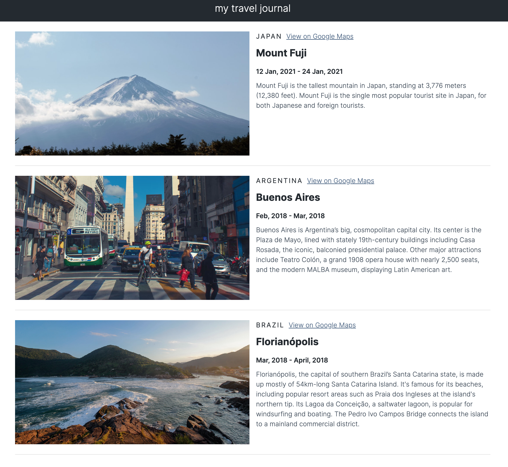

Quick start:

```
$ yarn # npm install
$ yarn build # npm run build
````

## Development

Run Webpack in watch-mode to continually compile the JavaScript as you work:

```
$ yarn watch # npm run watch
```

## Simple Travel Journal

The Simple Travel Journal project is to build a single page using React that renders a list of places traveled using data from a .js file. The project is to work on using props in React.



Solo project from [The Frontend Career Path](https://scrimba.com/learn/frontend) at Scrimba